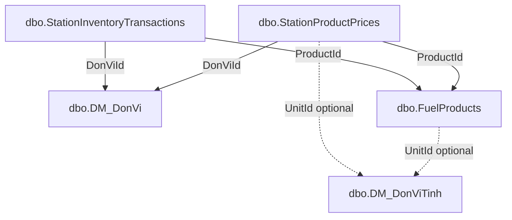

# Schema extensions (beyond `docs/architecture/database.md`)

**Source of truth:** `docs/architecture/database.md` (this repository does not ship `docs/database/schema.md`; use `docs/architecture/database.md` for table and column names).

This file documents database objects introduced or extended by the app relative to the original DMPPortal baseline. Most extensions are **new tables** only; the **store admin** slice also includes **approved columns** on the existing `dbo.DM_DonVi` table (see [Store admin — petrol station catalog & inventory](#store-admin--petrol-station-catalog--inventory) below).

## EF Core migration strategy (startup)

- **When:** On API startup (`Program.cs`), immediately after `WebApplication.Build()`, **before** middleware and endpoints run.
- **How:** `DatabaseMigrationExtensions.ApplyDmpPortalMigrations` resolves `DmpPortalDbContext` from a **short-lived scope**, checks `GetPendingMigrations()`, and if any exist calls **`DbContext.Database.Migrate()`** (synchronous `Migrate`, not `EnsureCreated` / `EnsureDeleted`). Only migrations **not** already recorded in `__EFMigrationsHistory` are applied; **existing data is not dropped** by this API path.
- **Error handling:** The migration call is wrapped in **try/catch**. On failure, **`LogError`** records the exception and it is **rethrown** so the host does not continue with an out-of-date schema.
- **Logging:** **Information** when there are zero pending migrations; **Information** with migration id list before applying; **Information** on success after `Migrate()`; **Error** on failure (then rethrow).
- **What gets applied:** Whatever migrations exist under `Shared/Persistence/Migrations/` for this context (e.g. station hours/reviews/bad reports, store-admin fuel tables/columns on `DM_DonVi`, and any future additive migrations).
- **Catalog seed (after migrate):** `SeedFuelProductCatalogIfNeeded` runs next and inserts default `FuelProducts` rows only when each `Code` is absent (see [Seed data (`FuelProducts`)](#seed-data-fuelproducts) below). **No** `DM_DonVi` rows are inserted.
- **Production caution:** The SQL login must be allowed to run DDL (`ALTER TABLE`, `CREATE TABLE`, etc.). On a **shared** legacy database, review each migration in staging; some teams prefer `dotnet ef database update` in CI/CD and disabling or gating startup migration per environment.

## `dbo.StationOperatingHours`

Weekly opening template per petrol station (`DM_DonVi.Id` where `CapDonViId = 248`).

| Column | Type | Null | Description |
|--------|------|------|-------------|
| `Id` | `int` IDENTITY | NO | Primary key |
| `DonViId` | `int` | NO | FK → `DM_DonVi.Id` (ON DELETE CASCADE) |
| `DayOfWeek` | `tinyint` | NO | `System.DayOfWeek` (`0` = Sunday … `6` = Saturday) |
| `OpensAt` | `time(0)` | YES | Local opening time (Vietnam). `NULL` with `IsClosedAllDay = 0` and `ClosesAt NULL` ⇒ treated as **24h open** for that day |
| `ClosesAt` | `time(0)` | YES | Local closing time. If `OpensAt > ClosesAt`, interval spans midnight |
| `IsClosedAllDay` | `bit` | NO | `1` ⇒ closed that whole day |

Unique index: `(DonViId, DayOfWeek)`.

**API:** `GET /api/stations`, `GET /api/stations/map`, `GET /api/stations/{id}` use Vietnam (`Asia/Ho_Chi_Minh`) local time for `openNow` / `openStatus` and query parameter `status=all|open|closed`.

**Migration:** `AddStationOperatingHours` (EF Core).

## `dbo.StationReviews`

Public visitor ratings for a petrol station (`DM_DonVi.Id` where `CapDonViId = 248`).

| Column | Type | Null | Description |
|--------|------|------|-------------|
| `Id` | `int` IDENTITY | NO | Primary key |
| `StationId` | `int` | NO | FK → `DM_DonVi.Id` (ON DELETE CASCADE) |
| `Rating` | `tinyint` | NO | 1–5 |
| `Comment` | `nvarchar(2000)` | YES | Optional text |
| `CreatedAt` | `datetime2` | NO | UTC when the review was stored |

Indexes: `StationId`; composite `(StationId, CreatedAt)` for newest-first listing.

**API:** `POST /api/stations/{id}/reviews`, `GET /api/stations/{id}/reviews`, `GET /api/stations/{id}/rating-summary` (anonymous).

## `dbo.StationReviewImages`

Optional image URLs linked to a review.

| Column | Type | Null | Description |
|--------|------|------|-------------|
| `Id` | `int` IDENTITY | NO | Primary key |
| `ReviewId` | `int` | NO | FK → `StationReviews.Id` (ON DELETE CASCADE) |
| `ImageUrl` | `nvarchar(2048)` | NO | Absolute `http`/`https` URL (validated at API) |

Index: `ReviewId`.

**Migration:** `AddStationReviews` (EF Core).

## `dbo.StationBadReports`

Private misconduct / incident reports (not exposed to public read APIs). Optional link to a petrol station.

| Column | Type | Null | Description |
|--------|------|------|-------------|
| `Id` | `int` IDENTITY | NO | Primary key |
| `StationId` | `int` | YES | FK → `DM_DonVi.Id` when set; `NULL` for non-station-specific reports. **ON DELETE SET NULL** |
| `Content` | `nvarchar(max)` | NO | Report text (API validates max 8000 characters) |
| `CreatedAt` | `datetime2` | NO | UTC when stored |
| `Status` | `tinyint` | NO | `0` = Pending, `1` = UnderReview, `2` = Resolved (app enum `StationBadReportStatus`) |

Indexes: `StationId`; `(CreatedAt, Id)` for admin listing.

**Public API:** `POST /api/bad-reports` only (returns `id` + `createdAt` — no report listing for anonymous users).

**Admin API:** `GET /api/admin/bad-reports`, `GET /api/admin/bad-reports/{id}` — requires HTTP header `X-Admin-Api-Key` matching configuration `Admin:ApiKey` (environment variable `Admin__ApiKey`). If `ApiKey` is empty, admin routes reject authentication.

## `dbo.StationBadReportImages`

Evidence URLs for a bad report.

| Column | Type | Null | Description |
|--------|------|------|-------------|
| `Id` | `int` IDENTITY | NO | Primary key |
| `ReportId` | `int` | NO | FK → `StationBadReports.Id` (ON DELETE CASCADE) |
| `ImageUrl` | `nvarchar(2048)` | NO | Absolute `http`/`https` URL (validated at API) |

Index: `ReportId`.

**Migration:** `AddStationBadReports` (EF Core).

---

## Store admin — petrol station catalog & inventory

Planned work for **cửa hàng xăng dầu** (store admin): product master data, **per-station** selling prices with effective dating, and **per-station** stock movements. All objects below are specified in `docs/architecture/database.md` under **STORE ADMIN SCHEMA EXTENSION**.

### What will be added

| Object | Change | Purpose |
|--------|--------|---------|
| `dbo.DM_DonVi` | Add nullable columns `OpenTime` (`time`), `CloseTime` (`time`) | Simple **default daily** opening/closing times on the station row (Vietnamese labels in schema: giờ mở/đóng cửa). Complements optional weekly detail in `StationOperatingHours` when both are populated. |
| `dbo.FuelProducts` | New table | Canonical list of fuels/products sold at stations: code, name, optional hierarchy (`ParentId`), default display unit (`UnitId` → `DM_DonViTinh.Id`, logical only), lifecycle and ordering fields. |
| `dbo.StationProductPrices` | New table | **History-capable** retail price per station (`DonViId`) and product (`ProductId`), optional price `UnitId`, `EffectiveDate`, `IsCurrent`, audit fields. |
| `dbo.StationInventoryTransactions` | New table | **Append-only style** stock ledger lines: quantity in/out (`TransactionType`: `1` nhập, `-1` xuất), optional monetary `Amount`, `TransactionDate`, per station and product. |

### Why it is added

- **Store admin** needs a place to configure **which products exist**, **what they cost at which station**, and **how stock moved** without overloading legacy reporting tables (`TK_*`, `QT_*`).
- **Reuse** of `DM_DonVi` (petrol station row) and **`DM_DonViTinh`** for measurement units keeps alignment with existing lookups already referenced elsewhere in the schema (e.g. `TK_ChiTieuBaoCao.DonViTinhId` → `DM_DonViTinh.Id`).
- **`OpenTime` / `CloseTime`** on `DM_DonVi` support a lightweight “default hours” UX; the app already has **`StationOperatingHours`** for **per-day-of-week** rules—product owners should decide precedence when both are set (document in API/UI later; not a migration concern).

### Dependencies between tables (logical)

The schema document marks **physical FK count as 0** for these new tables (“logic FK” only). That matches legacy style where integrity is enforced in application code. EF Core migrations can still create tables **without** declaring `FOREIGN KEY` constraints to stay faithful to the documented contract; alternatively, optional real FKs improve referential integrity but **diverge** from the written “0 FK” note—decide explicitly in implementation (staging review).

**Creation order for DDL:**

1. `FuelProducts` (no dependency on other new tables).
2. `StationProductPrices` (requires existing `DM_DonVi` rows and `FuelProducts` rows at **data** level).
3. `StationInventoryTransactions` (same).
4. `DM_DonVi.OpenTime` / `CloseTime` can be applied in the **same** or a **separate** migration; `ALTER TABLE` has no dependency on the new tables.

### Relationship to existing backend model

| Area | Already in backend | Gap vs approved extension |
|------|-------------------|---------------------------|
| `DM_DonVi` | Entity `DmDonVi`, configuration `DmDonViConfiguration`, mapped in `DmpPortalDbContext` | Missing `OpenTime`, `CloseTime` on entity, configuration, and snapshot. |
| `DM_DonViTinh` | Referenced only indirectly (e.g. `TkChiTieuBaoCao.DonViTinhId`); **no** `DbSet` / entity for `DM_DonViTinh` in `DmpPortalDbContext` today | `FuelProducts.UnitId` and `StationProductPrices.UnitId` remain **int?** logical references unless you later add a read-only `DmDonViTinh` entity. |
| `FuelProducts` / `StationProductPrices` / `StationInventoryTransactions` | **None** | New entities, `IEntityTypeConfiguration<>`, `DbSet<>`, and one or more EF migrations. |
| Station scope rule | `PetrolRetailConstants.CapDonViId = 248` used in APIs and store-admin | `docs/architecture/database.md` store-admin section aligned on **`CapDonViId = 248`** (not `CapTrenId`). |

### EF Core migration plan (high level)

1. **Design review (non-code):** Confirm station filter semantics against production data if anything drifts; confirm whether migrations should create **logical-only** links (no SQL FK) as per `docs/architecture/database.md`.
2. **Migration A — `DM_DonVi` columns:** `ALTER TABLE dbo.DM_DonVi ADD OpenTime time NULL, CloseTime time NULL;` Update `DmDonVi` + `DmDonViConfiguration` + model snapshot. **Risk:** brief metadata lock on `DM_DonVi` in busy environments—schedule off-peak if needed.
3. **Migration B — `FuelProducts`:** `CREATE TABLE` with columns exactly as in `docs/architecture/database.md`; **unique** constraint on `Code` (`nvarchar(50)` NOT NULL). Identity on `Id`. Defaults for `IsActive` / timestamps if not specified in DB must match schema (e.g. `IsActive` NOT NULL requires default or application-set on insert).
4. **Migration C — `StationProductPrices`:** `CREATE TABLE` with `decimal(18,2)` for `Price`, `datetime` types as per doc. Consider filtered unique index **only if** product rules require a single `IsCurrent = 1` per `(DonViId, ProductId)`—**not** listed in schema doc; add only if approved separately.
5. **Migration D — `StationInventoryTransactions`:** `CREATE TABLE` with `Quantity decimal(18,3)`, `Amount decimal(18,2) NULL`, `TransactionType int NOT NULL`, `TransactionDate datetime NOT NULL`.
6. **Apply:** `dotnet ef database update` (or app startup `MigrateAsync()` already used by this API) against **existing** databases—**do not** drop or recreate the database.

Steps 3–5 may be **one** EF migration or **several**, depending on team preference; dependency order above still applies within `Up()`.

### Affected entities and configurations (when implemented)

- **Update:** `Shared/Persistence/Entities/DmDonVi.cs` — add `TimeSpan?` or `TimeOnly?` for `OpenTime` / `CloseTime` (map to SQL `time`).
- **Update:** `Shared/Persistence/Configurations/DmDonViConfiguration.cs` — column types for `time`.
- **New:** entity + configuration for `FuelProducts`, `StationProductPrices`, `StationInventoryTransactions` (class names PascalCase per .NET convention; **table names** remain exactly `FuelProducts`, `StationProductPrices`, `StationInventoryTransactions`).
- **Update:** `DmpPortalDbContext.cs` — register `DbSet<>` for each new entity.
- **Update:** `Shared/Persistence/Migrations/*ModelSnapshot.cs` and new migration file(s).

### Possible risks

| Risk | Mitigation |
|------|------------|
| **Wrong `DM_DonVi` discriminator in code** | Store-admin and public station APIs scope by `CapDonViId == PetrolRetailConstants.CapDonViId`; re-validate against DB if business rules change. |
| **Duplicate concepts for hours** (`OpenTime`/`CloseTime` vs `StationOperatingHours`) | Define product rule: which wins, or merge for display only. |
| **`DM_DonVi` ALTER** in production | Short lock; test on staging copy; consider single batch migration. |
| **No physical FKs** | Orphan `ProductId` / `DonViId` possible if application bugs; add integration tests or optional DB constraints if policy allows. |
| **`IsCurrent` integrity** on prices | Without a filtered unique index, multiple “current” rows per station/product are possible; enforce in transaction or add an approved index later. |
| **`Inventory Calculation` section** in `docs/architecture/database.md` is empty | Ledger-based stock may need a documented aggregation rule (sum of `Quantity` by sign of `TransactionType`)—confirm with domain before exposing “balance” APIs. |
| **Angular admin** | Must call real APIs once implemented; no mock data when endpoints exist (per project rules). |

### Seed data (`FuelProducts`)

On API startup, **after** `Database.Migrate()`, `FuelProductCatalogSeeder` inserts default catalog rows **only when each `Code` is missing** (idempotent; no `DM_DonVi` rows are seeded).

| `Code` | `Name` | `ParentId` (via parent `Code`) | `UnitId` |
|--------|--------|--------------------------------|----------|
| `NHIEN_LIEU` | Nhiên liệu | — | `NULL` |
| `XANG` | Xăng | `NHIEN_LIEU` | `NULL` |
| `DAU` | Dầu | `NHIEN_LIEU` | `NULL` |
| `RON95` | RON95 | `XANG` | `DM_DonViTinh.Id` when a **liter** row exists (see below), else `NULL` |
| `E5RON92` | E5RON92 | `XANG` | same as `RON95` |
| `DIESEL` | Diesel | `DAU` | same as `RON95` |

**`DM_DonViTinh`:** `UnitId` for the three leaf rows is set only if a single row is found with `Ma` (trimmed, uppercased) in `LIT`, `L`, `LITRE`, or `Ten` in `Lít` / `Lit`. The lookup uses read-only SQL against `dbo.DM_DonViTinh` (`Id`, `Ma`, `Ten` columns). If the table is missing, columns differ, or no match exists, leaves are still inserted with `UnitId = NULL`. **No new unit rows are inserted.**

Audit fields: `Created` / `Modified` = UTC `DateTime` at insert; `CreatedBy` / `ModifiedBy` = `seed`.

